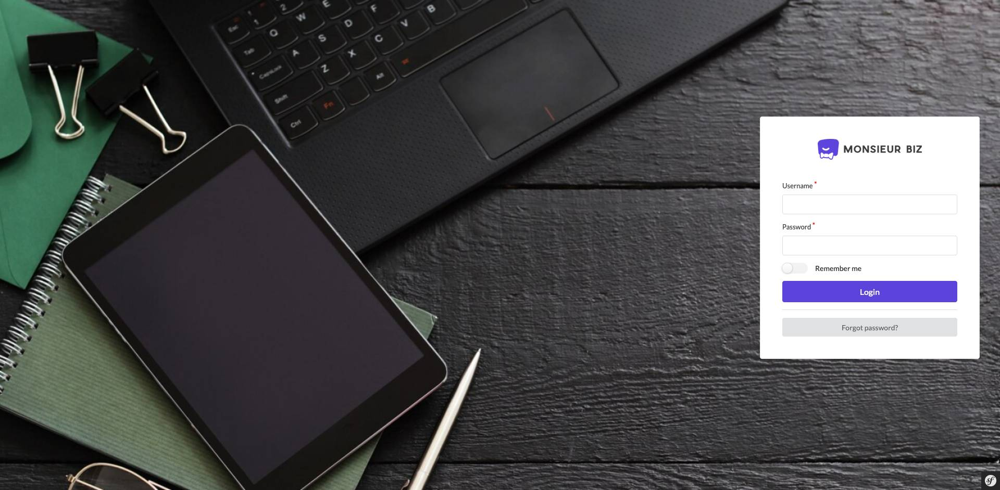
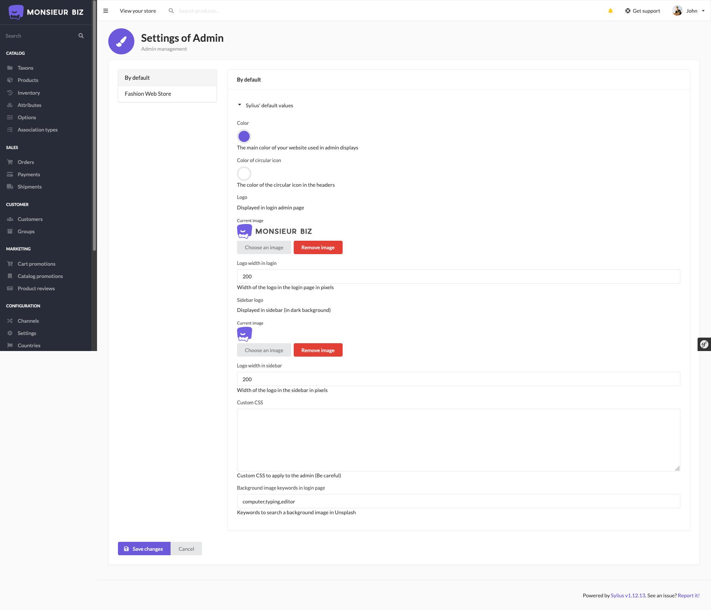

<h1 align="center">Sylius Better Admin</h1>

[](https://github.com/monsieurbiz/SyliusBetterAdminPlugin/blob/master/LICENSE.txt)
[](https://github.com/monsieurbiz/SyliusBetterAdminPlugin/actions?query=workflow%3ATests)
[](https://github.com/monsieurbiz/SyliusBetterAdminPlugin/actions?query=workflow%3ASecurity)
[](https://github.com/monsieurbiz/SyliusBetterAdminPlugin/actions?query=workflow%3ASecurity)

This plugins allows you to customize colors, logos and background of the Sylius Admin Panel.



## Compatibility

| Sylius Version | PHP Version |
|---|---|
| 1.11 | 8.0 - 8.1 |
| 1.12 | 8.1 - 8.2 |
| 1.13 | 8.1 - 8.2 |

## Installation

If you want to use our recipes, you can configure your composer.json by running:

```bash
composer config --no-plugins --json extra.symfony.endpoint '["https://api.github.com/repos/monsieurbiz/symfony-recipes/contents/index.json?ref=flex/master","flex://defaults"]'
```

```bash
composer require monsieurbiz/sylius-better-admin-plugin
```

You can copy the templates to customize the display of the admin panel:

```
mkdir -p templates/bundles/;
cp -Rv vendor/monsieurbiz/sylius-better-admin-plugin/src/Resources/views/SyliusUiBundle templates/bundles/;
cp -Rv vendor/monsieurbiz/sylius-better-admin-plugin/src/Resources/views/SyliusAdminBundle templates/bundles/;
cp -Rv vendor/monsieurbiz/sylius-better-admin-plugin/src/Resources/views/MonsieurBizSyliusAdminBetterLoginPlugin templates/bundles/;
```

## Admin form



## License

This plugin is under the MIT license.
Please see the [LICENSE](LICENSE) file for more information.
